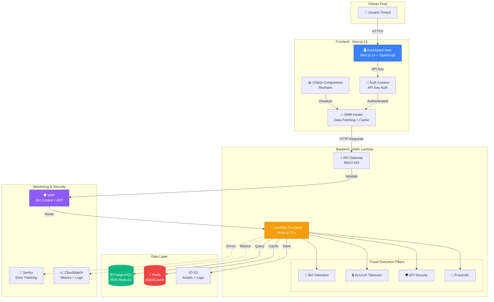
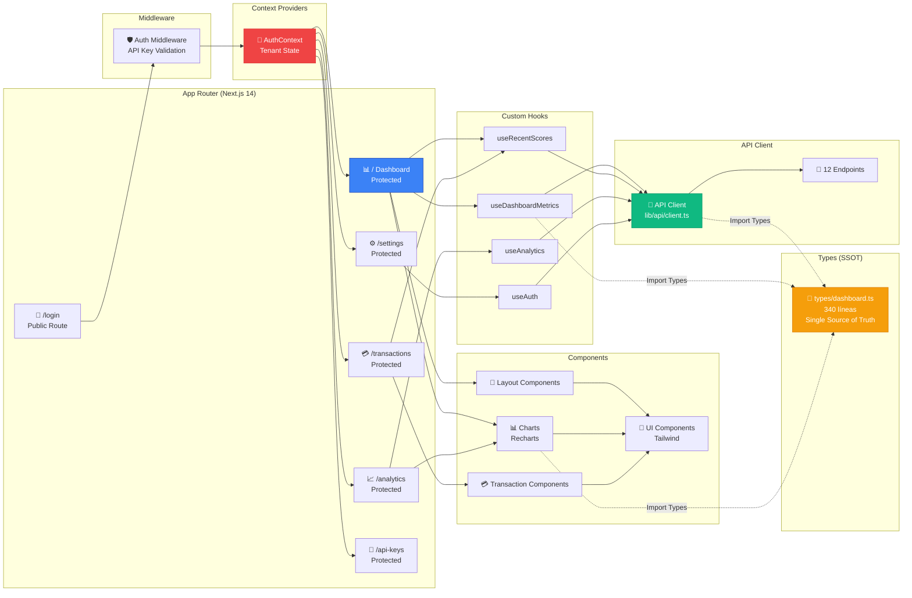
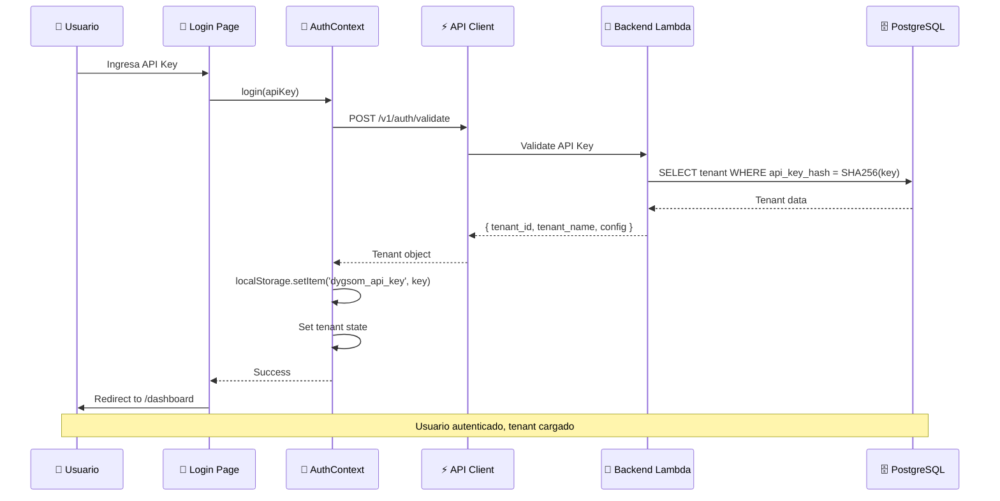
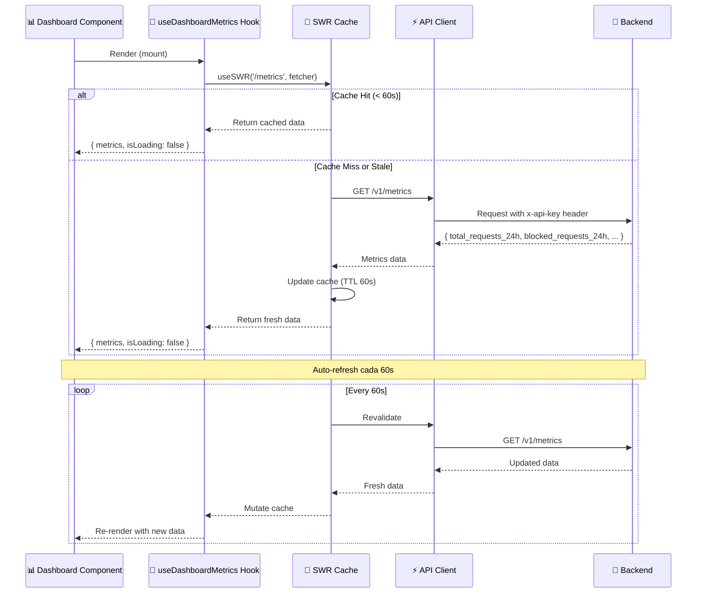
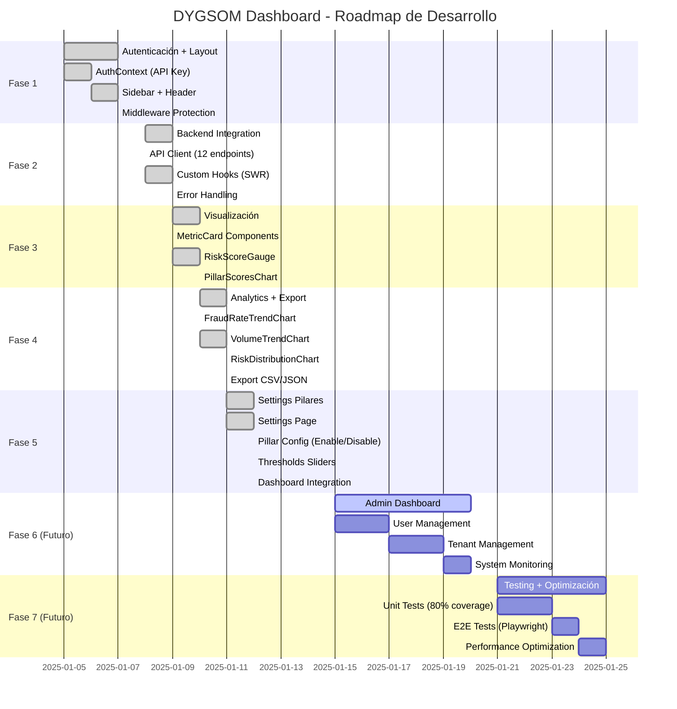

# 🛡️ DYGSOM Fraud Detection - Dashboard Tenant

<div align="center">


**Dashboard web profesional para detección de fraude en tiempo real**

**🌐 QA Deployment**: https://qa.d14hmcmg18hg84.amplifyapp.com  
**📡 API Backend**: https://y6absnh73b.execute-api.sa-east-1.amazonaws.com/prod

[Características](#-características-principales) •
[Arquitectura](#-arquitectura-tecnológica) •
[Quick Start](#-quick-start) •
[Documentación](#-documentación)

</div>

---

## 📋 Tabla de Contenidos

- [Descripción](#-descripción)
- [Características Principales](#-características-principales)
- [Arquitectura Tecnológica](#-arquitectura-tecnológica)
- [Stack Técnico](#-stack-técnico)
- [Quick Start](#-quick-start)
- [Estructura del Proyecto](#-estructura-del-proyecto)
- [Hoja de Ruta](#-hoja-de-ruta)
- [Documentación Técnica](#-documentación-técnica)
- [Estado del Proyecto](#-estado-del-proyecto)

---

## 📖 Descripción

### Descripción Funcional

**DYGSOM Fraud Detection Dashboard** es la interfaz web de administración para clientes (tenants) del sistema de detección de fraude DYGSOM. Permite a las organizaciones:

- 🔍 **Monitorear** detecciones de fraude en tiempo real
- 📊 **Analizar** tendencias y patrones de fraude
- ⚙️ **Configurar** pilares de detección y umbrales de riesgo
- 🔑 **Gestionar** API keys para integración
- 📈 **Exportar** reportes y analytics en CSV/JSON

El dashboard está diseñado para equipos de seguridad, fraude y operaciones que necesitan visibilidad inmediata sobre intentos de fraude y la capacidad de ajustar la configuración de detección según sus necesidades específicas.

### Descripción Técnica

Aplicación web **Next.js 14** con **App Router**, desarrollada en **TypeScript 5.9** y estilizada con **Tailwind CSS 4**. Implementa autenticación basada en **API Key** (no JWT), data fetching con **SWR** para caching y auto-refresh, y arquitectura **SSOT** (Single Source of Truth) con types centralizados.

**Características técnicas clave:**
- ✅ **Type-safe:** 0 errores TypeScript, strict mode habilitado
- ✅ **Performance:** Build optimizado (102-228 kB First Load JS)
- ✅ **Real-time:** SWR con auto-refresh cada 60s
- ✅ **Responsive:** Dark theme con diseño adaptativo
- ✅ **Modular:** Arquitectura basada en features (charts, transactions, layout)
- ✅ **Scalable:** Preparado para múltiples tenants con Row Level Security

---

## ✨ Características Principales

### 🎯 Dashboard Principal
- **Métricas 24h:** Total requests, bloqueados, riesgo promedio, latencia
- **Risk Score Gauge:** Visualización del último score de riesgo
- **Pillar Scores:** Gráfico de barras con scores por pilar (Bot Detection, ATO, API Security, Fraud ML)
- **Pillar Signals:** Cards expandibles con señales detalladas por pilar
- **Distribution Chart:** Distribución de acciones (allow/block/challenge/friction)

### 📊 Analytics Avanzada
- **Fraud Rate Trend:** Tendencia de tasa de fraude (line chart)
- **Volume Trend:** Volumen de requests por período (bar chart)
- **Risk Distribution:** Distribución de niveles de riesgo (pie chart)
- **Export Data:** Exportación CSV/JSON de analytics
- **Auto-refresh:** Actualización automática cada 60s

### 💳 Gestión de Transacciones
- **Lista paginada:** 20/50/100/200 registros por página
- **Filtros avanzados:** Por acción, riesgo, fecha
- **Progress bars:** Visualización de risk scores
- **Badges pilares:** Colores distintivos por pilar
- **Detail modal:** Vista detallada de cada detección

### ⚙️ Configuración de Pilares
- **Enable/Disable:** Activar/desactivar pilares individualmente
- **Thresholds:** Sliders 0-100% para umbrales de riesgo
- **Actions:** Selector de acción por pilar (allow/block/challenge/friction)
- **Save/Reset:** Guardar configuración o resetear a defaults
- **Real-time feedback:** Cambios reflejados inmediatamente en dashboard

### 🔑 Gestión de API Keys
- **Listar keys:** Todas las API keys del tenant
- **Crear nueva:** Generación de API key con nombre personalizado
- **Revocar:** Desactivar keys comprometidas
- **Last used:** Timestamp de último uso

---

## 🔐 Authentication & API Configuration

### Authentication Flow

**⚠️ CRITICAL: Dashboard uses API Key authentication (not JWT)**

```typescript
// AuthContext validates tenant via /health endpoint
const validateApiKey = async (apiKey: string) => {
  const response = await fetch(`${API_URL}/health`, {
    method: 'POST',
    headers: {
      'Content-Type': 'application/json',
      'X-API-Key': apiKey,
    },
    body: JSON.stringify({
      event_type: 'login',
      ip_address: '127.0.0.1',
      user_id: 'dashboard_auth_check',
    }),
  });
  
  if (response.ok) {
    const data = await response.json();
    // Extract tenant info from response
    setTenant(data.tenant);
    return true;
  }
  return false;
};
```

### Environment Variables

**QA Environment:**
```bash
NEXT_PUBLIC_API_URL=https://y6absnh73b.execute-api.sa-east-1.amazonaws.com/prod
NEXT_PUBLIC_API_VERSION=v1
```

**Test Credentials:**
```
API Key: dygsom_Test2026LatamQA_SecureKey123
Tenant: DYGSOM Test Company
Status: active (enterprise tier)
```

### API Endpoints Used

**Currently Implemented:**
- `OPTIONS /v1/health` - CORS preflight (returns 200 + headers)
- `POST /v1/health` - Fraud scoring + authentication validation

**Planned for v1.1:**
- `POST /v1/auth/validate` - Dedicated authentication endpoint
- `GET /v1/dashboard` - Dashboard metrics
- `GET /v1/analytics` - Analytics data
- `GET /v1/transactions` - Transaction history
- `GET /v1/config` - Tenant configuration

**Note**: Currently using `/health` endpoint for both fraud scoring and authentication. Future versions will separate concerns with dedicated endpoints.

### Type Definitions

**Tenant Interface (aligned with backend):**
```typescript
interface Tenant {
  tenant_id: string;      // UUID from database
  tenant_name: string;    // Company name
  tier: string;          // basic | professional | enterprise
  status: string;        // active | inactive | suspended
  config: {
    features?: string[];
    limits?: {
      requests_per_day?: number;
      requests_per_minute?: number;
    };
  };
}
```

**⚠️ Troubleshooting**: See [../docs/FASE-6-ANALISIS-DEPLOYMENT-ISSUES.md](../docs/FASE-6-ANALISIS-DEPLOYMENT-ISSUES.md) for authentication and CORS issues.

---

## 🏗️ Arquitectura Tecnológica

### Arquitectura General del Sistema



### Arquitectura Frontend Detallada



### Flujo de Autenticación



### Flujo de Data Fetching (SWR)



### Arquitectura de Pilares de Detección

```mermaid
graph TD
    subgraph "Dashboard Frontend"
        SETTINGS[⚙️ Settings Page]
        CONFIG[📝 TenantConfig State]
    end

    subgraph "Backend Processing"
        LAMBDA[⚡ Lambda Score Handler]

        subgraph "Pillar Orchestration"
            ORCHESTRATOR[🎯 Pillar Orchestrator<br/>Promise.all()]
        end

        subgraph "Fraud Pillars"
            BOT[🤖 Bot Detection<br/>deviceKnown, ipScore,<br/>rateSuspicious]
            ATO[🔒 Account Takeover<br/>breached, impossibleTravel,<br/>velocitySuspicious]
            APISEC[🛡️ API Security<br/>burstDetected,<br/>injectionAttempts]
            ML[🧠 Fraud ML<br/>amountAnomaly,<br/>locationAnomaly]
        end

        AGGREGATOR[📊 Score Aggregator<br/>Weighted Average]
        DECISION[🎲 Decision Engine<br/>Apply Action]
    end

    subgraph "Data Sources"
        REDIS[(⚡ Redis Cache<br/>IP scores, HIBP,<br/>tenant config)]
        PG[(🗄️ PostgreSQL<br/>Historical data,<br/>Tenant config)]
    end

    SETTINGS -->|PUT /tenant/config| LAMBDA
    LAMBDA -->|Load config| PG
    PG -->|Cache| REDIS

    LAMBDA --> ORCHESTRATOR

    ORCHESTRATOR -->|Parallel| BOT
    ORCHESTRATOR -->|Parallel| ATO
    ORCHESTRATOR -->|Parallel| APISEC
    ORCHESTRATOR -->|Parallel| ML

    BOT -->|Score 0-1| AGGREGATOR
    ATO -->|Score 0-1| AGGREGATOR
    APISEC -->|Score 0-1| AGGREGATOR
    ML -->|Score 0-1| AGGREGATOR

    AGGREGATOR -->|Final Score| DECISION
    CONFIG -->|Thresholds| DECISION

    DECISION -->|allow/block/<br/>challenge/friction| LAMBDA

    style ORCHESTRATOR fill:#3b82f6,stroke:#1e40af,color:#fff
    style AGGREGATOR fill:#10b981,stroke:#059669,color:#fff
    style DECISION fill:#ef4444,stroke:#dc2626,color:#fff
```

---

## 🛠️ Stack Técnico

### Core Framework

| Tecnología | Versión | Propósito |
|------------|---------|-----------|
| **Next.js** | 14.2 | React framework con App Router, SSR, ISR |
| **React** | 18.3 | Library UI con hooks y context |
| **TypeScript** | 5.9 | Type safety, strict mode |
| **Node.js** | 20.x | Runtime JavaScript |

### Styling & UI

| Tecnología | Versión | Propósito |
|------------|---------|-----------|
| **Tailwind CSS** | 4.1 | Utility-first CSS framework |
| **Recharts** | 2.x | Charts y visualizaciones |
| **Lucide React** | Latest | Iconos SVG optimizados |
| **clsx** | 2.x | Conditional classNames |

### Data Fetching & State

| Tecnología | Versión | Propósito |
|------------|---------|-----------|
| **SWR** | 2.x | Data fetching, caching, revalidation |
| **React Context** | Built-in | Global state (Auth) |
| **localStorage** | Built-in | API Key persistence |

### Backend Integration

| Tecnología | Versión | Propósito |
|------------|---------|-----------|
| **Fetch API** | Native | HTTP client (no axios) |
| **API Key Auth** | Custom | Authentication (no JWT) |
| **REST API** | - | 12 endpoints backend |

### Development Tools

| Tecnología | Versión | Propósito |
|------------|---------|-----------|
| **ESLint** | 8.x | Code linting |
| **TypeScript Compiler** | 5.9 | Type checking |
| **PostCSS** | Latest | CSS processing |
| **Jest** | 29.x | Unit testing |

### Backend Services (Integración)

| Servicio | Configuración | Propósito |
|----------|---------------|-----------|
| **AWS Lambda** | 1024MB, Node.js 20.x | Backend serverless |
| **RDS PostgreSQL** | t3.small, 20GB | Base de datos principal |
| **ElastiCache Redis** | t3.micro, 1.5GB | Cache y sesiones |
| **API Gateway** | REST, 1M req/mes | API routing |
| **Amplify** | Hosting Next.js | Frontend hosting |
| **CloudFront** | CDN Global | Content delivery |
| **WAF** | Bot Control + ATP | Security layer |
| **Sentry** | 50k errors/mes | Error tracking |

---

## 🚀 Quick Start

### Prerrequisitos

Antes de comenzar, asegúrate de tener instalado:

- ✅ **Node.js** 20.x o superior ([Download](https://nodejs.org/))
- ✅ **npm** 10.x o superior (incluido con Node.js)
- ✅ **Git** para control de versiones
- ⚠️ **Backend API** corriendo (ver [Backend Setup](#backend-setup))

### Instalación

```bash
# 1. Clonar repositorio
git clone https://github.com/dygsom/dygsom-fraud-dashboard.git
cd dygsom-fraud-dashboard

# 2. Instalar dependencias
npm install

# 3. Configurar variables de entorno
cp .env.example .env.local

# Editar .env.local con tu configuración:
# NEXT_PUBLIC_API_URL=http://localhost:3000/v1
# NEXT_PUBLIC_ENVIRONMENT=development
# NEXT_PUBLIC_LOG_LEVEL=debug
```

### Backend Setup

El dashboard requiere que el backend esté corriendo. Ver documentación completa en:

📘 **[Backend Documentation](../dygsom-fraud-detection/README.md)**

```bash
# Si tienes el backend con Docker (recomendado para desarrollo)
cd ../dygsom-fraud-detection
docker compose up -d

# Si tienes el backend desplegado en AWS
# Solo configura NEXT_PUBLIC_API_URL en .env.local
# Ejemplo: NEXT_PUBLIC_API_URL=https://api.dygsom.pe/v1
```

### Ejecutar Dashboard

```bash
# Modo desarrollo (puerto 3001)
npm run dev

# O especificar puerto
npm run dev -- --port 3003

# Abrir en navegador
# http://localhost:3001
```

### Build Producción

```bash
# Build optimizado
npm run build

# Iniciar producción
npm start

# Verificar type checking
npm run type-check

# Linting
npm run lint
```

### Credenciales de Desarrollo

Para desarrollo local (si backend está en mock mode):

```
API Key: dys_test_abc123xyz789def456ghi012jkl345
```

Para backend real, genera una API Key desde el endpoint:

```bash
curl -X POST http://localhost:3000/v1/api-keys \
  -H "x-api-key: YOUR_ADMIN_API_KEY" \
  -H "Content-Type: application/json" \
  -d '{"name":"Dashboard Dev Key"}'
```

---

## 📁 Estructura del Proyecto

```
dygsom-fraud-dashboard/
├── 📱 app/                          # Next.js 14 App Router
│   ├── (auth)/                      # Rutas públicas (no protegidas)
│   │   └── login/
│   │       └── page.tsx             # Página de login con API Key
│   ├── (dashboard)/                 # Rutas protegidas (requieren auth)
│   │   ├── layout.tsx               # Layout dashboard (Sidebar + Header)
│   │   ├── page.tsx                 # 📊 Dashboard principal (Fases 1-3)
│   │   ├── analytics/
│   │   │   └── page.tsx             # 📈 Analytics + Export (Fase 4)
│   │   ├── settings/
│   │   │   └── page.tsx             # ⚙️ Settings pilares (Fase 5)
│   │   ├── transactions/
│   │   │   └── page.tsx             # 💳 Transacciones con filtros
│   │   └── api-keys/
│   │       └── page.tsx             # 🔑 Gestión API Keys
│   ├── api/
│   │   └── health/
│   │       └── route.ts             # Health check endpoint
│   ├── layout.tsx                   # Root layout (metadata, fonts)
│   ├── globals.css                  # Global styles (Tailwind)
│   ├── icon.tsx                     # Favicon dinámico
│   └── viewport.ts                  # Viewport config
│
├── 🧩 components/                   # React components (feature-based)
│   ├── charts/                      # Componentes de visualización
│   │   ├── FraudRateTrendChart.tsx  # Line chart (Fase 4)
│   │   ├── VolumeTrendChart.tsx     # Bar chart (Fase 4)
│   │   ├── RiskDistributionChart.tsx # Pie chart (Fase 4)
│   │   ├── PillarScoresChart.tsx    # Scores por pilar (Fase 5)
│   │   ├── PillarSignalsCard.tsx    # Señales detalladas
│   │   ├── RiskScoreGauge.tsx       # Gauge de riesgo
│   │   └── index.ts                 # Barrel export
│   ├── layout/                      # Componentes de layout
│   │   ├── Sidebar.tsx              # Navegación lateral
│   │   ├── MobileSidebar.tsx        # Sidebar responsive
│   │   ├── Header.tsx               # Barra superior
│   │   └── index.ts
│   ├── transactions/                # Feature: Transacciones
│   │   ├── TransactionFilters.tsx   # Filtros avanzados
│   │   ├── TransactionSearch.tsx    # Búsqueda
│   │   ├── TransactionDetailModal.tsx # Modal detalle
│   │   ├── Pagination.tsx           # Paginación
│   │   ├── SortableHeader.tsx       # Headers ordenables
│   │   └── index.ts
│   └── ui/                          # UI base components (Tailwind)
│       ├── button.tsx               # Botón
│       ├── card.tsx                 # Card container
│       ├── input.tsx                # Input field
│       ├── label.tsx                # Label
│       ├── select.tsx               # Select dropdown
│       ├── slider.tsx               # Slider (Fase 5)
│       ├── toggle-switch.tsx        # Toggle (Fase 5)
│       ├── MetricCard.tsx           # Card de métrica
│       ├── modal.tsx                # Modal
│       ├── table.tsx                # Table
│       ├── toast.tsx                # Toasts
│       └── index.ts
│
├── 🔗 hooks/                        # Custom React hooks
│   ├── useAuth.ts                   # Hook de autenticación
│   ├── useDashboardMetrics.ts       # Hook métricas 24h
│   ├── useRecentScores.ts           # Hook detecciones recientes
│   └── useAnalytics.ts              # Hook analytics (Fase 4)
│
├── 🔐 context/                      # React Context providers
│   └── AuthContext.tsx              # Auth state global (tenant, apiKey)
│
├── 📡 lib/                          # Core libraries
│   ├── api/
│   │   ├── client.ts                # ⭐ API Client (12 endpoints)
│   │   ├── endpoints.ts             # Endpoint definitions
│   │   └── index.ts
│   ├── utils/
│   │   ├── format.ts                # Formateo (fechas, números, scores)
│   │   ├── validation.ts            # Validaciones
│   │   ├── cn.ts                    # clsx + tailwind-merge
│   │   └── index.ts
│   ├── logger.ts                    # Sistema de logging
│   ├── storage.ts                   # localStorage wrapper
│   └── constants/
│       └── index.ts                 # Constantes globales
│
├── 📘 types/                        # TypeScript types (SSOT)
│   ├── dashboard.ts                 # ⭐ 340 líneas - ÚNICA fuente de verdad
│   ├── auth.ts                      # Types de autenticación
│   ├── api.ts                       # Types de API responses
│   └── index.ts                     # Barrel export
│
├── ⚙️ config/                       # Configuración
│   ├── constants.ts                 # Constantes de la app
│   ├── routes.ts                    # Definición de rutas
│   └── index.ts
│
├── 🛡️ middleware.ts                 # Auth middleware (protección rutas)
│
├── 🧪 __tests__/                    # Tests (5 tests actualmente)
│   ├── components/
│   │   ├── Button.test.tsx
│   │   └── Input.test.tsx
│   └── lib/
│       ├── format.test.ts
│       └── validation.test.ts
│
├── 📚 docs/                         # Documentación del proyecto
│   ├── FASE-4-COMPLETADA.md        # Analytics + Export
│   ├── FASE-5-COMPLETADA.md        # Settings pilares
│   ├── AUDITORIA-FINAL-DASHBOARD-COMPLETO.md # Audit 98.2/100
│   └── REVALIDACION-DASHBOARD-FASE-1-2-3.md
│
├── 🗂️ cleanup-artifacts/            # Archivos deprecados (no usados)
│
├── 📄 package.json                  # Dependencies y scripts
├── 📄 tsconfig.json                 # TypeScript config (strict mode)
├── 📄 tailwind.config.ts            # Tailwind config (slate theme)
├── 📄 next.config.js                # Next.js config
├── 📄 .env.example                  # Variables de entorno template
├── 📄 .gitignore                    # Git ignore rules
├── 📄 RULES_DASH.md                 # ⭐ Estándares y buenas prácticas
└── 📄 README.md                     # Este archivo
```

### Archivos Clave

| Archivo | Líneas | Propósito |
|---------|--------|-----------|
| `types/dashboard.ts` | 340 | ⭐ SSOT - Única fuente de tipos |
| `lib/api/client.ts` | 190 | API Client con 12 endpoints |
| `app/(dashboard)/settings/page.tsx` | 412 | Settings page (Fase 5) |
| `hooks/useAnalytics.ts` | 219 | Hook analytics (Fase 4) |
| `app/(dashboard)/page.tsx` | 213 | Dashboard principal |
| `RULES_DASH.md` | 2,553 | Estándares del proyecto |

---

## 🗺️ Hoja de Ruta

### Estado Actual: Fase 5 Completada ✅



### Fase 1: Autenticación + Layout ✅ Completada

**Objetivo:** Estructura base del dashboard con autenticación API Key

- ✅ AuthContext con API Key authentication (no JWT)
- ✅ Login page con validación de API Key
- ✅ Middleware de protección de rutas
- ✅ Sidebar responsive con navegación
- ✅ Header con tenant info
- ✅ Dark theme (slate colors)

**Resultado:** 100% completo - Base sólida establecida

---

### Fase 2: Backend Integration ✅ Completada

**Objetivo:** Integración completa con backend Lambda

- ✅ API Client (`lib/api/client.ts`) - 12 endpoints
- ✅ Custom hooks con SWR (auto-refresh 60s)
  - `useDashboardMetrics()` - Métricas 24h
  - `useRecentScores()` - Detecciones recientes
- ✅ Error handling centralizado (ApiError class)
- ✅ localStorage para API Key persistence

**Resultado:** 100% completo - 0 errores TypeScript

---

### Fase 3: Visualización ✅ Completada

**Objetivo:** Componentes de visualización de datos

- ✅ MetricCard - Cards de métricas con iconos
- ✅ RiskScoreGauge - Gauge de riesgo promedio
- ✅ PillarScoresChart - Gráfico de barras (scores por pilar)
- ✅ PillarSignalsCard - Cards expandibles con señales
- ✅ Dashboard page integrado

**Resultado:** 100% completo - UX moderna y responsive

---

### Fase 4: Analytics + Export ✅ Completada

**Objetivo:** Analytics avanzada con exportación de datos

- ✅ Analytics page (`app/(dashboard)/analytics/page.tsx`)
- ✅ FraudRateTrendChart - Line chart con tendencia
- ✅ VolumeTrendChart - Bar chart de volumen
- ✅ RiskDistributionChart - Pie chart de distribución
- ✅ Export CSV/JSON funcional
- ✅ Hook `useAnalytics()` con SWR (219 líneas)

**Resultado:** 98/100 audit - 1 console.error a corregir

**Documentación:** [FASE-4-COMPLETADA.md](./docs/FASE-4-COMPLETADA.md)

---

### Fase 5: Settings Pilares ✅ Completada

**Objetivo:** Configuración de pilares de detección

- ✅ Settings page (`app/(dashboard)/settings/page.tsx` - 412 líneas)
- ✅ Enable/Disable por pilar (toggle switches)
- ✅ Threshold sliders (0-100% → 0-1 backend)
- ✅ Action selectors (allow/block/challenge/friction)
- ✅ Save configuration con loading state
- ✅ Reset to defaults
- ✅ Dashboard actualizado (solo muestra pilares activos)
- ✅ PillarScoresChart filtrado (pilares deshabilitados ocultos)
- ✅ PillarSignalsCard con validación

**Resultado:** 98/100 audit - 2 console.error a corregir

**Documentación:** [FASE-5-COMPLETADA.md](./docs/FASE-5-COMPLETADA.md)

---

### Fase 6: Admin Dashboard 🔄 Planificada

**Objetivo:** Dashboard administrativo para gestión de tenants

**Infraestructura:** ✅ Preparada (ver [GUIA-DESPLIEGUE-AWS-LATAM-OPTIMIZADA.md](../docs/GUIA-DESPLIEGUE-AWS-LATAM-OPTIMIZADA.md))

**Funcionalidades planeadas:**

1. **User Management**
   - Crear/editar/eliminar usuarios admin
   - Roles y permisos granulares
   - Audit logs de acciones admin

2. **Tenant Management**
   - Listar todos los tenants
   - Crear nuevo tenant (auto-generar API Key)
   - Editar configuración de tenant
   - Deshabilitar/habilitar tenant
   - Métricas por tenant

3. **System Monitoring**
   - Dashboard global (todos los tenants)
   - Métricas de performance
   - Error tracking agregado
   - Cost monitoring

4. **Configuration**
   - Settings globales del sistema
   - Feature flags
   - Rate limits por tenant

**Stack adicional:**
- Next.js 14 (separado: `dygsom-admin-dashboard`)
- Amplify Hosting (misma infraestructura)
- RLS policies específicas para admin

**Estimado:** 1-2 semanas

---

### Fase 7: Testing + Optimización 🔄 Planificada

**Objetivo:** Aumentar cobertura de tests y optimizar performance

**Testing:**

1. **Unit Tests** (Objetivo: 80% coverage)
   - Hooks: `useAuth`, `useDashboardMetrics`, `useAnalytics`
   - API client: Error handling, authentication
   - Utils: `format.ts`, `validation.ts`
   - Components: Forms, modals

2. **Integration Tests**
   - API Client → Backend integration
   - Auth flow end-to-end
   - SWR caching behavior

3. **E2E Tests (Playwright)**
   - Login flow
   - Dashboard navigation
   - Settings save/reset
   - Export CSV/JSON

**Optimización:**

1. **Performance**
   - Image optimization (`next/image`)
   - Chart lazy loading
   - Bundle size reduction
   - API response caching (Redis)

2. **Code Quality**
   - Refactor `any` types (ApiError.response)
   - Remove console statements
   - Add JSDoc comments
   - Improve error messages

**Estimado:** 1 semana

---

### Fase 8: Despliegue AWS 🔄 Planificada

**Objetivo:** Desplegar dashboard en AWS sa-east-1

**Guía oficial:** [GUIA-DESPLIEGUE-AWS-LATAM-OPTIMIZADA.md](../docs/GUIA-DESPLIEGUE-AWS-LATAM-OPTIMIZADA.md)

**Servicios:**
- ✅ Amplify Hosting (Next.js)
- ✅ CloudFront CDN (Edge en Lima < 10ms)
- ✅ Route 53 DNS
- ✅ Certificate Manager (SSL/TLS)
- ✅ WAF (Bot Control + ATP)

**Costo:** $15/mes (Amplify Hosting incluido en total $366.50/mes)

**Timeline:** 8.5 días (Fases 1-10 de guía de despliegue)

---

## 📚 Documentación Técnica

### Principios de Arquitectura

#### 1. SSOT (Single Source of Truth)

**Archivo:** `types/dashboard.ts` (340 líneas)

Todos los tipos TypeScript están centralizados en un único archivo. NUNCA redefinir tipos en otros archivos.

```typescript
// ✅ CORRECTO
import type { ScoreResponse } from '@/types/dashboard';

// ❌ INCORRECTO
interface ScoreResponse { ... } // Redefinición prohibida
```

#### 2. DRY (Don't Repeat Yourself)

**Archivos:** `lib/utils/format.ts`, `lib/utils/validation.ts`

Funciones reutilizables para formateo y validación. NO duplicar lógica.

```typescript
// ✅ CORRECTO
import { formatRiskScore, getRiskScoreColor } from '@/lib/utils/format';

// ❌ INCORRECTO
const percentage = Math.round(score * 100) + '%'; // Duplicación
```

#### 3. Fail Fast

Validar TEMPRANO y fallar RÁPIDO. No continuar con datos inválidos.

```typescript
// ✅ CORRECTO
if (!tenant || !apiKey) {
  redirect('/login');
}

// ❌ INCORRECTO
// Continuar renderizando sin validar
```

#### 4. Type Safety

0 errores TypeScript, strict mode habilitado, NO `any` types (salvo Recharts justificados).

```typescript
// ✅ CORRECTO
export function formatRiskScore(score: number): string { ... }

// ❌ INCORRECTO
export function formatRiskScore(score: any): any { ... }
```

### API Client

**Archivo:** `lib/api/client.ts` (190 líneas)

Centraliza TODAS las llamadas al backend. 12 endpoints implementados.

```typescript
// Uso
import { api } from '@/lib/api/client';

// Auth
const tenant = await api.auth.validate();

// Metrics
const metrics = await api.metrics.get();

// Scores
const scores = await api.scores.recent({ limit: 20, offset: 0 });

// Analytics
const fraudRate = await api.analytics.fraudRate();
const volume = await api.analytics.volume();
const distribution = await api.analytics.riskDistribution();

// API Keys
const keys = await api.apiKeys.list();
const newKey = await api.apiKeys.create('My Key');
await api.apiKeys.revoke('key_id');

// Tenant Config
const config = await api.tenant.getConfig();
await api.tenant.updateConfig({ pillars: { bot_detection: false } });
```

### Custom Hooks

#### useAuth()

Acceso al contexto de autenticación.

```typescript
const { tenant, apiKey, isLoading, login, logout } = useAuth();
```

#### useDashboardMetrics()

Métricas 24h con auto-refresh 60s.

```typescript
const { metrics, isLoading, isError, mutate } = useDashboardMetrics();
// metrics: { total_requests_24h, blocked_requests_24h, avg_risk_score_24h, ... }
```

#### useRecentScores()

Detecciones recientes con paginación.

```typescript
const { scores, isLoading, isError, mutate } = useRecentScores({
  limit: 20,
  offset: 0,
  action: 'block',
});
```

#### useAnalytics()

Analytics combinada (fraud rate, volume, risk distribution).

```typescript
const { fraudRate, volume, distribution, isLoading } = useAnalytics();
```

### Estándares de Código

**Documento oficial:** [RULES_DASH.md](./RULES_DASH.md) (2,553 líneas)

#### Prohibiciones

| Prohibición | Razón |
|-------------|-------|
| ❌ NO `console.log` | Usar `lib/logger.ts` en su lugar |
| ❌ NO `any` types | Usar types específicos o `unknown` |
| ❌ NO emojis en código | Solo en UI/comments |
| ❌ NO `var` | Usar `const` o `let` |
| ❌ NO non-null assertion `!` | Usar optional chaining `?.` |
| ❌ NO CSS Modules | Solo Tailwind CSS |
| ❌ NO @ts-ignore | Resolver el problema, no ocultarlo |
| ❌ NO Redux/Zustand | Context + SWR es suficiente |

#### Naming Conventions

```typescript
// ✅ Componentes: PascalCase
export function MetricCard() { ... }

// ✅ Hooks: camelCase con 'use' prefix
export function useAuth() { ... }

// ✅ Utils: camelCase
export function formatRiskScore() { ... }

// ✅ Constants: UPPER_SNAKE_CASE
const API_BASE_URL = ...;

// ✅ Types: PascalCase
export interface ScoreResponse { ... }
```

#### File Headers

Todos los archivos deben tener header JSDoc:

```typescript
/**
 * Dashboard Metrics Hook
 *
 * Fetches and caches dashboard metrics (24h) with SWR.
 * Auto-refresh every 60s.
 *
 * @module hooks/useDashboardMetrics
 */
```

---

## 📊 Estado del Proyecto

### Backend (dygsom-fraud-detection)

**Repositorio:** `D:\code\dygsom\dygsom-fraud-detection`

| Aspecto | Estado | Detalles |
|---------|--------|----------|
| **Tests** | 272/278 passing | 97.8% pass rate |
| **Coverage** | 70.29% | Aceptable (target 80%) |
| **TypeScript** | 0 errors | ✅ Perfecto |
| **Fases** | 5/5 completas | ✅ 100% |
| **API Endpoints** | 12 implementados | ✅ Todos funcionando |
| **Deployment** | Pendiente | Guía AWS completa |

**Documentación:** [Backend README](../dygsom-fraud-detection/README.md)

---

### Dashboard (dygsom-fraud-dashboard)

**Repositorio:** `D:\code\dygsom\dygsom-fraud-dashboard` (este proyecto)

| Aspecto | Estado | Detalles |
|---------|--------|----------|
| **TypeScript** | 0 errors | ✅ Perfecto |
| **Build** | SUCCESS | ✅ Compilación exitosa |
| **Fases** | 5/5 completas | ✅ 100% |
| **Audit Score** | 98.2/100 | ⭐⭐⭐⭐⭐ |
| **Console.log** | 4 a corregir | ⚠️ Antes de producción |
| **Testing** | 5 tests | ⚠️ Mejorar post-MVP |
| **Deployment** | Pendiente | Guía AWS completa |

**Auditoría completa:** [AUDITORIA-FINAL-DASHBOARD-COMPLETO.md](./docs/AUDITORIA-FINAL-DASHBOARD-COMPLETO.md)

---

### Build Metrics

```bash
Route (app)                              Size     First Load JS
┌ ○ /                                    4.62 kB         221 kB
├ ○ /analytics                           11.3 kB         228 kB
├ ○ /settings                            6.21 kB         102 kB
└ ○ /transactions                        2.21 kB         107 kB
+ First Load JS shared by all            87.3 kB

ƒ Middleware                             26.8 kB
```

**Análisis:**
- ✅ Dashboard principal: 4.62 kB (excelente)
- ✅ Analytics: 11.3 kB (aceptable con Recharts)
- ✅ Settings: 6.21 kB (bueno para 412 líneas)
- ✅ Transactions: 2.21 kB (excelente optimización)

---

### Issues Conocidos

#### 🔴 Críticos (Pre-Producción)

1. **Console statements en producción** (4 archivos)
   - `components/layout/MobileSidebar.tsx:66` - `console.log`
   - `app/(dashboard)/analytics/page.tsx:51` - `console.error`
   - `app/(dashboard)/settings/page.tsx:70` - `console.error`
   - `app/(dashboard)/settings/page.tsx:120` - `console.error`

   **Solución:** Reemplazar con `logger.error()` o eliminar

#### 🟡 No Críticos (Post-MVP)

1. **Testing coverage bajo** (5 tests, objetivo 80%)
   - Agregar tests para hooks
   - Tests para API client
   - Tests E2E con Playwright

2. **ApiError con `unknown` type** (ya corregido por user)
   - ✅ Cambiado de `any` a `unknown`

---

## 🚀 Deployment

### AWS Deployment (Producción)

**Guía oficial:** [GUIA-DESPLIEGUE-AWS-LATAM-OPTIMIZADA.md](../docs/GUIA-DESPLIEGUE-AWS-LATAM-OPTIMIZADA.md)

**Región:** sa-east-1 (São Paulo, Brasil)
**Hosting:** AWS Amplify
**CDN:** CloudFront con Edge en Lima (< 10ms)
**Costo:** $15/mes (incluido en total $366.50/mes del sistema completo)

#### Quick Deploy

```bash
# 1. Build producción
npm run build

# 2. Deploy con Amplify CLI
amplify init
amplify add hosting
amplify publish

# O manual en AWS Console:
# Amplify → New app → Connect GitHub → Deploy
```

#### Variables de Entorno (Producción)

```bash
NEXT_PUBLIC_API_URL=https://api.dygsom.pe/v1
NEXT_PUBLIC_ENVIRONMENT=production
NEXT_PUBLIC_LOG_LEVEL=error
```

### Docker Deployment (Opcional)

```dockerfile
# Dockerfile
FROM node:20-alpine AS base

# Install dependencies
FROM base AS deps
WORKDIR /app
COPY package.json package-lock.json ./
RUN npm ci

# Build application
FROM base AS builder
WORKDIR /app
COPY --from=deps /app/node_modules ./node_modules
COPY . .
RUN npm run build

# Production image
FROM base AS runner
WORKDIR /app
ENV NODE_ENV=production
COPY --from=builder /app/public ./public
COPY --from=builder /app/.next/standalone ./
COPY --from=builder /app/.next/static ./.next/static

EXPOSE 3000
CMD ["node", "server.js"]
```

```bash
# Build y run
docker build -t dygsom-dashboard .
docker run -p 3000:3000 -e NEXT_PUBLIC_API_URL=http://backend:3000/v1 dygsom-dashboard
```

---

## 🧪 Testing

### Scripts de Testing

```bash
# Type checking
npm run type-check

# Linting
npm run lint

# Unit tests
npm test

# Test coverage
npm run test:coverage

# Build test
npm run build
```

### Coverage Actual

```
File                      | % Stmts | % Branch | % Funcs | % Lines |
--------------------------|---------|----------|---------|---------|
All files                 |   15.2  |    8.3   |   18.9  |   15.2  |
 lib/utils/format.ts      |   100   |   100    |   100   |   100   |
 lib/utils/validation.ts  |   100   |   100    |   100   |   100   |
 components/ui/button.tsx |    50   |     0    |    50   |    50   |
 components/ui/input.tsx  |    50   |     0    |    50   |    50   |
```

**Objetivo:** 80% coverage (Fase 7)

---

## 📚 Documentación Adicional

### Documentos del Proyecto

| Documento | Descripción |
|-----------|-------------|
| [RULES_DASH.md](./RULES_DASH.md) | ⭐ Estándares y buenas prácticas (2,553 líneas) |
| [AUDITORIA-FINAL-DASHBOARD-COMPLETO.md](./docs/AUDITORIA-FINAL-DASHBOARD-COMPLETO.md) | Auditoría profesional completa (98.2/100) |
| [FASE-4-COMPLETADA.md](./docs/FASE-4-COMPLETADA.md) | Analytics + Export (Fase 4) |
| [FASE-5-COMPLETADA.md](./docs/FASE-5-COMPLETADA.md) | Settings pilares (Fase 5) |
| [REVALIDACION-DASHBOARD-FASE-1-2-3.md](./docs/REVALIDACION-DASHBOARD-FASE-1-2-3.md) | Revalidación Fases 1-3 |

### Backend Documentation

| Documento | Descripción |
|-----------|-------------|
| [Backend README](../dygsom-fraud-detection/README.md) | Backend fraud detection API |
| [PASOS-DESARROLLO-MVP.md](../docs/PASOS-DESARROLLO-MVP.md) | Desarrollo backend Fases 1-5 |
| [ARQUITECTURA-PRAGMATICA-FINAL.md](../docs/ARQUITECTURA-PRAGMATICA-FINAL.md) | Arquitectura técnica backend |

### AWS Deployment

| Documento | Descripción |
|-----------|-------------|
| [README-DESPLIEGUE.md](../docs/README-DESPLIEGUE.md) | ⭐ Guía para elegir docs de despliegue |
| [GUIA-DESPLIEGUE-AWS-LATAM-OPTIMIZADA.md](../docs/GUIA-DESPLIEGUE-AWS-LATAM-OPTIMIZADA.md) | ✅ Guía oficial AWS sa-east-1 |
| [DECISION-ARQUITECTURA-AWS.md](../docs/DECISION-ARQUITECTURA-AWS.md) | ADR justificando sa-east-1 |
| [INDEX-DOCUMENTACION.md](../docs/INDEX-DOCUMENTACION.md) | Índice maestro de documentación |

---

## 🤝 Contribución

### Workflow de Desarrollo

```bash
# 1. Crear rama para feature
git checkout -b feature/nueva-funcionalidad

# 2. Hacer cambios
# ... editar archivos ...

# 3. Verificar calidad
npm run type-check
npm run lint
npm run build

# 4. Commit (seguir convenciones)
git add .
git commit -m "feat: descripción del cambio"

# 5. Push rama
git push origin feature/nueva-funcionalidad

# 6. Crear Pull Request en GitHub
```

### Convenciones de Commit

```bash
feat: Nueva funcionalidad
fix: Corrección de bug
docs: Cambios en documentación
style: Formateo, sin cambios de código
refactor: Refactorización de código
test: Agregar o modificar tests
chore: Tareas de mantenimiento
```

---

## 📞 Soporte y Contacto

### Equipo

**Proyecto:** DYGSOM Fraud Detection Platform
**Equipo:** DYGSOM Engineering Team
**Mantenido por:** Equipo DYGSOM + Claude Sonnet 4.5

### Enlaces

- **GitHub:** https://github.com/dygsom/dygsom-fraud-dashboard
- **Backend:** https://github.com/dygsom/dygsom-fraud-detection
- **Documentation:** D:\code\dygsom\docs\

### Estado del Proyecto

- ✅ **Backend:** Producción-ready (272/278 tests, 70.29% coverage)
- ✅ **Dashboard:** Producción-ready tras correcciones (98.2/100 audit)
- 🔄 **Deployment:** Guía completa disponible (8.5 días estimados)
- 🔄 **Admin Dashboard:** Infraestructura preparada (Fase 6)

---

## 📄 Licencia

MIT License - Ver [LICENSE](./LICENSE) para detalles

---

<div align="center">

**¿Preguntas? ¿Encontraste un bug? [Crea un issue](https://github.com/dygsom/dygsom-fraud-dashboard/issues)**

Hecho con ❤️ por el equipo DYGSOM

</div>
