🏗️ ARQUITECTURA COMPLETA DEL PROYECTO

```mermaid
graph TB
    subgraph "USUARIOS"
        U1[👤 Usuario Tenant<br/>empresa.pe]
        U2[👤 Admin DYGSOM<br/>admin.dygsom.pe]
    end

    subgraph "FASE 5: FRONTEND (AWS Amplify)"
        A1[🌐 Amplify Tenant Dashboard<br/>Next.js 14]
        A2[🌐 Amplify Admin Dashboard<br/>Next.js 14<br/>FUTURO]
        
        subgraph "Amplify Build Process"
            G1[📦 GitHub repo<br/>dygsom-fraud-dashboard]
            B1[⚙️ Build: npm run build<br/>SSG + SSR]
            D1[📤 Deploy: CloudFront CDN]
        end
    end

    subgraph "INTERNET"
        CF[☁️ CloudFront CDN<br/>Edge Locations<br/>Lima, São Paulo, etc.]
    end

    subgraph "FASE 4: BACKEND API (sa-east-1)"
        APIG[🌐 API Gateway<br/>y6absnh73b<br/>/prod/v1/*]
        
        subgraph "VPC Private Subnets"
            LAM[⚡ Lambda<br/>dygsom-fraud-api<br/>Node.js 20.x<br/>1024MB]
        end
    end

    subgraph "FASE 2 & 3: DATABASE & CACHE (sa-east-1)"
        subgraph "VPC Private Subnets"
            RDS[(🗄️ PostgreSQL<br/>dygsom-db-latam<br/>fraud_detection)]
            REDIS[(🔴 Redis<br/>dygsom-redis-latam<br/>Cache + Sessions)]
        end
    end

    subgraph "EXTERNAL APIS"
        HIBP[🔐 HIBP API<br/>Breach checks]
        IPQS[🌍 IPHub API<br/>IP reputation]
    end

    U1 -->|1. HTTPS| A1
    U2 -.->|FUTURO| A2
    
    A1 -->|2. Git push| G1
    G1 -->|3. Auto trigger| B1
    B1 -->|4. Deploy artifacts| D1
    D1 -->|5. CDN global| CF
    
    CF -->|6. Usuario accede| U1
    
    A1 -->|7. POST /v1/score<br/>X-API-Key: dk_live_xxx| APIG
    APIG -->|8. Invoke| LAM
    
    LAM -->|9. Query tenants<br/>requests| RDS
    LAM -->|10. Cache GET/SET| REDIS
    LAM -->|11. Check email| HIBP
    LAM -->|12. Check IP| IPQS
    
    LAM -->|13. Response JSON| APIG
    APIG -->|14. 200 OK| A1
    A1 -->|15. Render UI| U1

    style A1 fill:#FF9900
    style APIG fill:#FF9900
    style LAM fill:#FF9900
    style RDS fill:#527FFF
    style REDIS fill:#DC382D
    style CF fill:#FF9900
```




🔄 FLUJO COMPLETO: USUARIO → DASHBOARD → API → DB
# Escenario 1: Usuario hace LOGIN al Dashboard

```mermaid
sequenceDiagram
    actor Usuario as 👤 Usuario Tenant
    participant Amplify as 🌐 Amplify Dashboard
    participant CF as ☁️ CloudFront
    participant API as 🌐 API Gateway
    participant Lambda as ⚡ Lambda
    participant Redis as 🔴 Redis
    participant RDS as 🗄️ PostgreSQL

    Usuario->>CF: 1. GET https://main.xxxxx.amplifyapp.com
    Note over CF: Edge Location (Lima)
    CF->>Amplify: 2. Fetch static files (HTML, JS, CSS)
    Amplify-->>CF: 3. Return Next.js app
    CF-->>Usuario: 4. Dashboard loaded in browser
    
    Note over Usuario: Usuario ingresa API Key en login
    
    Usuario->>API: 5. POST /v1/auth/validate<br/>{"api_key": "dk_live_abc123"}
    API->>Lambda: 6. Invoke Lambda
    
    Lambda->>Redis: 7. GET tenant:dk_live_abc123
    
    alt Cache HIT
        Redis-->>Lambda: 8. Tenant data cached
    else Cache MISS
        Lambda->>RDS: 9. SELECT * FROM tenants WHERE api_key=...
        RDS-->>Lambda: 10. Tenant data
        Lambda->>Redis: 11. SET tenant:dk_live_abc123 (TTL 1h)
    end
    
    Lambda-->>API: 12. {"valid": true, "tenant_id": "uuid", "name": "DYGSOM Peru"}
    API-->>Usuario: 13. 200 OK + JWT token
    
    Note over Usuario: Dashboard redirect to /dashboard
    Usuario->>API: 14. GET /v1/metrics<br/>Authorization: Bearer JWT
    API->>Lambda: 15. Invoke
    Lambda->>RDS: 16. SELECT COUNT(*) FROM requests WHERE tenant_id=...
    RDS-->>Lambda: 17. Metrics data
    Lambda-->>API: 18. Metrics JSON
    API-->>Usuario: 19. Display charts/graphs

    ```

# Escenario 2: Dashboard solicita SCORE de fraude
```mermaid
sequenceDiagram
    actor User as 👤 Admin en Dashboard
    participant UI as 🌐 Next.js Frontend
    participant API as 🌐 API Gateway
    participant Lambda as ⚡ Lambda (4 Pilares)
    participant RDS as 🗄️ PostgreSQL
    participant Redis as 🔴 Redis
    participant HIBP as 🔐 HIBP API
    participant IPHub as 🌍 IPHub API

    User->>UI: 1. Click "Test Fraud Check"
    UI->>UI: 2. Form: email, IP, user_id
    
    UI->>API: 3. POST /v1/score<br/>X-API-Key: dk_live_xxx<br/>Body: {event_type, email, ip...}
    
    API->>Lambda: 4. Invoke dygsom-fraud-api
    
    Note over Lambda: Handler recibe evento
    
    Lambda->>RDS: 5. Validate tenant + rate limits
    RDS-->>Lambda: 6. Tenant OK
    
    par Ejecución PARALELA (4 Pilares)
        Lambda->>Lambda: 7a. BotDetection Pillar
        Lambda->>Lambda: 7b. AccountTakeover Pillar
        Lambda->>HIBP: 7c. Check email breach
        HIBP-->>Lambda: 7c. Breach count
        Lambda->>Lambda: 7d. APISecurity Pillar
        Lambda->>IPHub: 7e. Check IP reputation
        IPHub-->>Lambda: 7e. IP score
        Lambda->>Lambda: 7f. FraudML Pillar (solo checkout)
    end
    
    Lambda->>Lambda: 8. Aggregate scores (weighted)
    
    Lambda->>RDS: 9. INSERT INTO requests (event, scores, action)
    Lambda->>Redis: 10. INCR tenant:requests:count
    
    Lambda-->>API: 11. Response:<br/>{<br/>  "request_id": "uuid",<br/>  "risk_score": 0.67,<br/>  "action": "review",<br/>  "pillars": {...}<br/>}
    
    API-->>UI: 12. 200 OK + Score JSON
    
    UI->>UI: 13. Render risk gauge<br/>Show pillar breakdown<br/>Highlight action
    
    UI-->>User: 14. Visual display:<br/>🔴 HIGH RISK (67%)<br/>Action: REVIEW
```


```mermaid
```


```mermaid
```